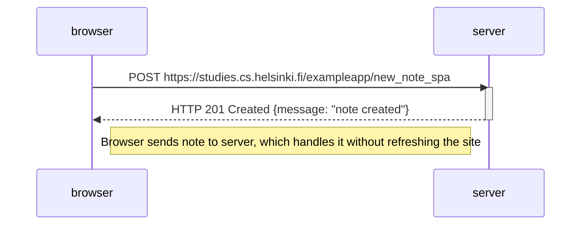

```mermaid
sequenceDiagram
    participant browser
    participant server

    browser->>server: POST https://studies.cs.helsinki.fi/exampleapp/new_note_spa
    activate server
    server-->>browser: HTTP 201 Created {message: "note created"}
    deactivate server

    Note right of browser: Browser sends note to server, which handles it without refreshing the site
```